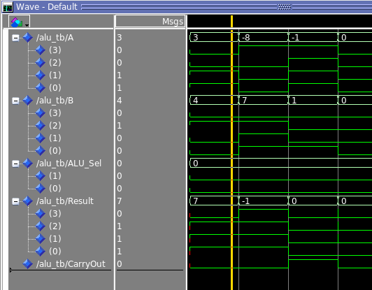
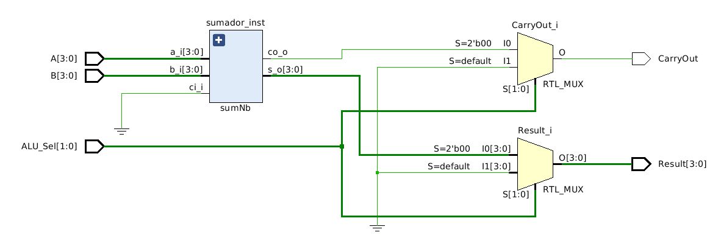
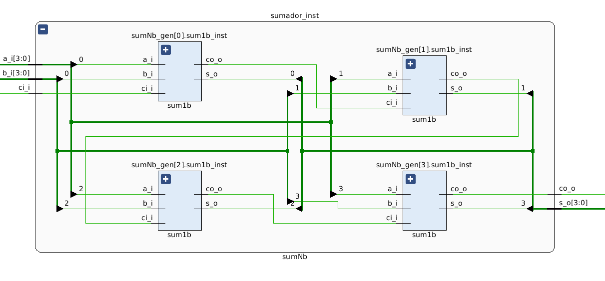
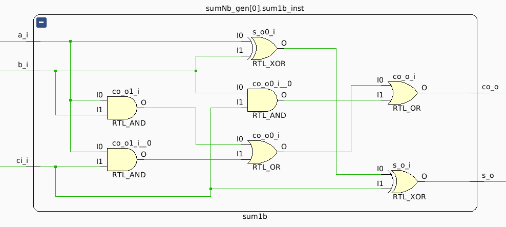

# Proyecto ALU (Unidad Aritmético-Lógica) en VHDL

## Descripción

Este proyecto implementa una Unidad Aritmético-Lógica (ALU) en VHDL. Una ALU es un componente esencial en los procesadores modernos, responsable de realizar operaciones aritméticas y lógicas sobre los datos. Este diseño modular permite la simulación y prueba de diferentes operaciones mediante bancos de pruebas detallados.

## Funcionalidades

La ALU soporta las siguientes operaciones:

- **Suma:** Realiza la suma de dos operandos de 4 bits y produce un resultado de 4 bits junto con un bit de acarreo.
- **Resta:** Realiza la resta entre dos operandos de 4 bits.
- **Multiplicación:** Calcula el producto de dos operandos de 4 bits.
- **División:** Realiza la división entre dos operandos de 4 bits y produce cociente y resto.
- **Operaciones Lógicas:** Incluye operaciones como AND, OR, y XOR entre los operandos de 4 bits.

## Estructura del Proyecto

El proyecto está organizado en varias carpetas para facilitar la gestión de componentes, bancos de pruebas y documentación:

- **src/**: Contiene los archivos fuente VHDL, organizados por componentes y módulos.
- **testbench/**: Incluye bancos de pruebas para verificar la funcionalidad de cada componente y de la ALU en conjunto.
- **sim/**: Archivos de simulación y scripts para ModelSim y GHDL.
- **doc/**: Documentación del proyecto, incluyendo especificaciones de diseño e informes de prueba.

## Requisitos

Para compilar y simular este proyecto, se necesita:

- ModelSim o GHDL para la simulación de archivos VHDL.
- Git para la gestión de versiones.

## Instrucciones de Uso

1. **Clonar el repositorio:**

   ```bash
   git clone https://github.com/cpatagon/ALU_project.git
```
## Estructura de Archivos


```plaintext
Proyecto_ALU/
├── src/
│ ├── components/
│ │ ├── sumador/
│ │ │ ├── sum1b.vhd
│ │ │ └── sumNb.vhd
│ │ ├── restador/
│ │ │ └── restador.vhd
│ │ ├── multiplicador/
│ │ │ └── multiplicador.vhd
│ │ ├── divisor/
│ │ │ └── divisor.vhd
│ │ └── mux.vhd
│ ├── top/
│ │ └── ALU.vhd
│ └── utils/
│ └── packages.vhd
├── testbench/
│ ├── ALU_tb.vhd
│ ├── sumNb_tb.vhd
│ ├── restador_tb.vhd
│ ├── multiplicador_tb.vhd
│ └── divisor_tb.vhd
├── sim/
│ ├── modelsim/
│ │ ├── waves.do
│ │ └── init.do
│ └── ghdl/
├── doc/
│ ├── design_spec.md
│ └── test_report.md
└── work/
```


## Simulaciones 


En la figura N°1 se muestra la salida de una simulación de una parte sumadora de la ALU 

El ejemplo implementado es 

```vhd

      -- Seleccionar operación de suma
        ALU_Sel <= "00";

        -- Prueba de suma: 3 + 4 = 7
        A <= "0011"; B <= "0100"; wait for 10 ns;
        assert (Result = "0111" and CarryOut = '0') report "Error: 3 + 4" severity error;

        -- Prueba de suma: 8 + 7 = 15
        A <= "1000"; B <= "0111"; wait for 10 ns;
        assert (Result = "1111" and CarryOut = '0') report "Error: 8 + 7" severity error;

        -- Prueba de suma con acarreo: 15 + 1 = 16
        A <= "1111"; B <= "0001"; wait for 10 ns;
        assert (Result = "0000" and CarryOut = '1') report "Error: 15 + 1" severity error;

        -- Prueba de suma: 0 + 0 = 0
        A <= "0000"; B <= "0000"; wait for 10 ns;
        assert (Result = "0000" and CarryOut = '0') report "Error: 0 + 0" severity error;
```


*Fig 1: Vista ModelSim de la simulación ALU* 


*Fig 2: Vista general diagrama ALU sumador en Vivado* 


*Fig 3: Vista sumador de  diagrama ALU en Vivado* 


*Fig 4: Vista lógica sumador  ALU en Vivado* 
